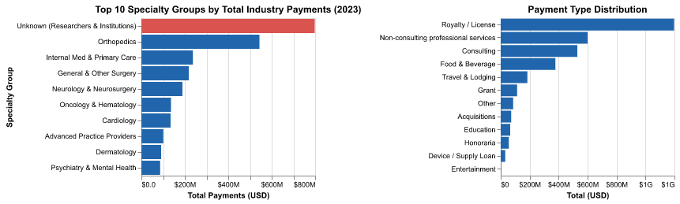
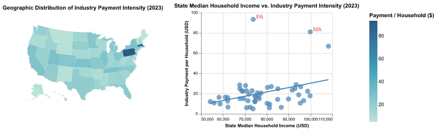
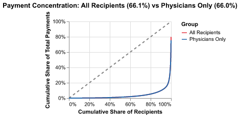

## Group Information

- **Group Member:** Quinn Gan
- **Lecture Section:** Mon/Wed 10:00 am - 11:50 am, Section 2
- **GitHub Username:** Qinyig
- **Repository:** Qinyig/final_project_30538_QG

## 1. Research Motivation & Question

The Physician Payment Sunshine Act is a key part of the Affordable Care Act. This law requires medical manufacturers to report all payments made to doctors and teaching hospitals. These records are managed through the CMS Open Payments program. The policy assumes that transparency reduces conflicts of interest. Ideally, public reporting ensures that clinical decisions remain objective and accountable.

However, transparency by itself is not enough. Raw data does not explain how industry funding is actually distributed across the system. This project investigates the structural patterns within those payments. I ask a central question: Are industry payments concentrated in specific specialties, payment types, or geographic regions? 

## 2. Data & Approach

This project integrates two datasets: CMS Open Payments (2023) and American Community Survey (ACS, 2023).

All raw data cleaning and standardization is handled in `preprocessing.py`. All merging, reshaping, and aggregation is performed in this document. The key metric is **payment intensity** (total payments per household), which allows fair cross-state comparisons regardless of population size.

Data Processing for Interactivity: The raw CMS dataset contains over 1.2 million records. To ensure the interactive dashboard remains responsive and stays within the hosting platform's memory limits, I limited the dashboard's active dataset to the first 800,000 records. This sample size remains large enough to maintain the statistical integrity of the geographic and specialty-based trends discussed in this report.

**Data Limitations:** The dataset captures payment amounts but not clinical outcomes, so I cannot establish causal links between payments and physician behavior. The "Unknown" specialty category (~$800M) reflects a CMS reporting gap for non-practicing researchers and institutions rather than true missing data.

## 3. Static Visualizations

**Industry Payments by Specialty Group：**
The "Unknown" category receives the highest funding, totaling approximately $800 million. This reflects the CMS reporting structure. CMS does not assign specific medical specialties to teaching hospitals or research institutions. Among identified clinical fields, Orthopedics ranks first with over $500 million. This amount is more than double any other specialty. Internal Medicine follows at roughly $237 million. While Orthopedics is driven by large device agreements, Internal Medicine payments consist mostly of high-frequency, low-value items like meals.

**Distribution of Payment Types：**
Royalty and License fees total approximately $1.19B, making them the largest payment category by a wide margin. Intellectual property therefore drives the main financial link between industry and medicine. Day-to-day marketing is not the primary factor. Non-consulting professional services rank second in total value. In contrast, Food and Beverage payments have a very small dollar value. However, these payments happen constantly. They represent routine, low-cost contact with a massive number of doctors.

```{python}
#| label: plot1-2
#| echo: false
import pandas as pd
import numpy as np
import altair as alt
alt.data_transformers.enable("vegafusion")

df_cms = pd.read_csv("data/derived-data/cms_payments_clean.csv")

# Group specialties into high-level categories.
# Unmatched specialties retain their original name (no "Other" catch-all).
conditions = [
    df_cms['specialty_clean'] == 'Unknown',
    df_cms['specialty_clean'].str.contains('Orthopaedic|Orthopedic', case=False, na=False) &
        ~df_cms['specialty_clean'].str.contains('Orthodontic', case=False, na=False),
    df_cms['specialty_clean'].str.contains('Cardio|Heart', case=False, na=False),
    df_cms['specialty_clean'].str.contains('Oncology|Hematolog', case=False, na=False),
    df_cms['specialty_clean'].str.contains('Neurolog|Neurosurg|Neuroradio', case=False, na=False),
    df_cms['specialty_clean'].str.contains('Psychiatr|Mental Health', case=False, na=False),
    df_cms['specialty_clean'].str.contains('Internal Medicine|Family Medicine|Family Health|General Practice|Primary Care|Adult Medicine', case=False, na=False),
    df_cms['specialty_clean'].str.contains('Nurse|Physician Assistant', case=False, na=False),
    df_cms['specialty_clean'].str.contains('Dermatolog', case=False, na=False),
    df_cms['specialty_clean'].str.contains('Surgery|Surgeon', case=False, na=False),
]

choices = [
    'Unknown (Researchers & Institutions)',
    'Orthopedics',
    'Cardiology',
    'Oncology & Hematology',
    'Neurology & Neurosurgery',
    'Psychiatry & Mental Health',
    'Internal Med & Primary Care',
    'Advanced Practice Providers',
    'Dermatology',
    'General & Other Surgery',
]

# Unmatched rows keep their original specialty_clean name
df_cms['specialty_grouped'] = np.select(conditions, choices, default=df_cms['specialty_clean'])

# Aggregate and take top 10
spec_totals = (
    df_cms.groupby('specialty_grouped')['payment_amount']
    .sum()
    .reset_index()
    .sort_values('payment_amount', ascending=False)
    .head(10)
)

spec_chart = alt.Chart(spec_totals).mark_bar().encode(
    x=alt.X('payment_amount:Q', title='Total Payments (USD)', axis=alt.Axis(format='$.2s')),
    y=alt.Y('specialty_grouped:N', sort='-x', title='Specialty Group'),
    color=alt.condition(
        alt.datum.specialty_grouped == 'Unknown (Researchers & Institutions)',
        alt.value('#d9534f'),
        alt.value('#2166ac')
    ),
    tooltip=[
        alt.Tooltip('specialty_grouped:N', title='Specialty Group'),
        alt.Tooltip('payment_amount:Q', format='$,.0f', title='Total Payments')
    ]
).properties(
    title='Top 10 Specialty Groups by Total Industry Payments (2023)',
    width=220,
    height=200
)

# --- Plot 2: Payment Type Logic ---
type_dist = (
    df_cms.groupby('payment_type_clean')['payment_amount']
    .sum().reset_index().sort_values('payment_amount', ascending=False)
)

type_chart = alt.Chart(type_dist).mark_bar().encode(
    x=alt.X('payment_amount:Q', title='Total (USD)', axis=alt.Axis(format='$.1s')),
    y=alt.Y('payment_type_clean:N', sort='-x', title=None),
    color=alt.value('#2166ac')
).properties(
    title='Payment Type Distribution',
    width=220,
    height=200
)

p1 = (spec_chart | type_chart).configure_axis(
    labelFontSize=9,
    titleFontSize=10
).configure_title(fontSize=12)

p1.save('plot1.png')
```
{width=85%}

**Geographic Distribution of Payment Intensity：**

Industry payments are not evenly distributed across the United States. The map shows a clear concentration in Northeastern states, particularly Pennsylvania and Massachusetts. These states host major medical research institutions. These organizations hold lucrative patents. As a result, they attract massive royalty payments. This pattern highlights a stark reality. Industry money follows research infrastructure and regional wealth. It does not follow patient healthcare needs.

```{python}
#| label: plot3-4
#| echo: false
from vega_datasets import data as vega_data
df_acs = pd.read_csv("data/derived-data/acs_state_clean.csv")

state_payments = (
    df_cms.groupby('state')['payment_amount']
    .sum()
    .reset_index()
)

df_state = pd.merge(
    state_payments,
    df_acs,
    left_on='state',
    right_on='state_abbr',
    how='inner'
)
df_state['payment_per_household'] = df_state['payment_amount'] / df_state['total_households']

states_topo = alt.topo_feature(vega_data.us_10m.url, 'states')

state_id_map = {
    'AL': 1, 'AK': 2, 'AZ': 4, 'AR': 5, 'CA': 6, 'CO': 8, 'CT': 9, 'DE': 10, 'FL': 12, 'GA': 13,
    'HI': 15, 'ID': 16, 'IL': 17, 'IN': 18, 'IA': 19, 'KS': 20, 'KY': 21, 'LA': 22, 'ME': 23,
    'MD': 24, 'MA': 25, 'MI': 26, 'MN': 27, 'MS': 28, 'MO': 29, 'MT': 30, 'NE': 31, 'NV': 32,
    'NH': 33, 'NJ': 34, 'NM': 35, 'NY': 36, 'NC': 37, 'ND': 38, 'OH': 39, 'OK': 40, 'OR': 41,
    'PA': 42, 'RI': 44, 'SC': 45, 'SD': 46, 'TN': 47, 'TX': 48, 'UT': 49, 'VT': 50, 'VA': 51,
    'WA': 53, 'WV': 54, 'WI': 55, 'WY': 56
}
df_state['id'] = df_state['state'].map(state_id_map)

map_chart = alt.Chart(states_topo).mark_geoshape().encode(
    color=alt.Color('payment_per_household:Q',
                    title='Payment / Household ($)',
                    scale=alt.Scale(scheme='tealblues')),
    tooltip=[
        alt.Tooltip('state_name:N', title='State'),
        alt.Tooltip('payment_per_household:Q', title='Payment per Household', format='$.2f'),
        alt.Tooltip('median_income:Q', title='Median Income', format='$,.0f')
    ]
).transform_lookup(
    lookup='id',
    from_=alt.LookupData(df_state, 'id', ['payment_per_household', 'state_name', 'median_income'])
).project(
    type='albersUsa'
).properties(
    title='Geographic Distribution of Industry Payment Intensity (2023)',
    width=260,
    height=200
)

# --- Plot 4: Scatter Plot ---
scatter = alt.Chart(df_state).mark_circle(size=100, opacity=0.7).encode(
    x=alt.X('median_income:Q',
            title='State Median Household Income (USD)',
            scale=alt.Scale(zero=False)),
    y=alt.Y('payment_per_household:Q',
            title='Industry Payment per Household (USD)'),
    color=alt.value('steelblue'),
    tooltip=[
        'state_name',
        alt.Tooltip('median_income:Q', format='$,.0f'),
        alt.Tooltip('payment_per_household:Q', format='$.2f')
    ]
).properties(
    title='State Median Household Income vs. Industry Payment Intensity (2023)',
    width=260,
    height=200
)

regression = scatter.transform_regression(
    'median_income', 'payment_per_household'
).mark_line(color='red')

outliers = df_state[df_state['state'].isin(['PA', 'MA'])]

labels = alt.Chart(outliers).mark_text(
    align='left',
    dx=6,
    dy=-4,
    fontSize=11,
    color='#d9534f'
).encode(
    x='median_income:Q',
    y='payment_per_household:Q',
    text='state:N'
)

p2 = (map_chart | (scatter + regression + labels)).configure_axis(
    labelFontSize=8,
    titleFontSize=9
).configure_title(fontSize=11)

p2.save('plot2.png')
```
{width=85%}

**Payment Concentration (Lorenz Curve):**
The plot reveals that excluding teaching hospitals changes almost nothing. The top 1% of individual physicians still capture 66.0% of these payments. So the extreme concentration is not a corporate outlier effect. Industry funds are not distributed broadly: a tiny elite captures the vast majority of this multibillion-dollar pool.
```{python}
#| label: plot5
#| echo: false

# All recipients
recipient_totals = (
    df_cms.groupby(['recipient_id', 'recipient_type'])['payment_amount']
    .sum()
    .sort_values(ascending=True)
    .reset_index()
)

recipient_totals['cum_percent_money'] = (
    recipient_totals['payment_amount'].cumsum() / recipient_totals['payment_amount'].sum()
)
recipient_totals['cum_percent_people'] = (
    (recipient_totals.index + 1) / len(recipient_totals)
)

# Physicians only (exclude Teaching Hospitals)
physician_totals = (
    df_cms[df_cms['recipient_type'] != 'Covered Recipient Teaching Hospital']
    .groupby('recipient_id')['payment_amount']
    .sum()
    .sort_values(ascending=True)
    .reset_index()
)

physician_totals['cum_percent_money'] = (
    physician_totals['payment_amount'].cumsum() / physician_totals['payment_amount'].sum()
)
physician_totals['cum_percent_people'] = (
    (physician_totals.index + 1) / len(physician_totals)
)

# Top 1% values
top_1_all = 1.0 - recipient_totals[
    recipient_totals['cum_percent_people'] <= 0.99
]['cum_percent_money'].max()

top_1_physicians = 1.0 - physician_totals[
    physician_totals['cum_percent_people'] <= 0.99
]['cum_percent_money'].max()

# Sample for plotting
all_sample = (
    recipient_totals
    .sample(n=min(5000, len(recipient_totals)), random_state=42)
    .sort_values('cum_percent_people')
    .assign(group='All Recipients')
)

physician_sample = (
    physician_totals
    .sample(n=min(5000, len(physician_totals)), random_state=42)
    .sort_values('cum_percent_people')
    .assign(group='Physicians Only')
)

combined = pd.concat([all_sample, physician_sample])

# Chart
curve = alt.Chart(combined).mark_line(strokeWidth=2).encode(
    x=alt.X('cum_percent_people:Q', title='Cumulative Share of Recipients', axis=alt.Axis(format='%')),
    y=alt.Y('cum_percent_money:Q', title='Cumulative Share of Total Payments', axis=alt.Axis(format='%')),
    color=alt.Color('group:N', 
                    title='Group',
                    scale=alt.Scale(
                        domain=['All Recipients', 'Physicians Only'],
                        range=['#e63946', '#2166ac']
                    )),
    tooltip=['group', 'cum_percent_people', 'cum_percent_money']
).properties(
    title=f'Payment Concentration: All Recipients ({top_1_all:.1%}) vs Physicians Only ({top_1_physicians:.1%})',
    width=200,
    height=150
)

equality_line = alt.Chart(pd.DataFrame({'x': [0, 1], 'y': [0, 1]})).mark_line(
    strokeDash=[5, 5], color='gray'
).encode(x='x', y='y')

p3 = (equality_line + curve)

p3.save('plot3.png')
```
{width=70% fig-align="center"}

## 4. Streamlit Dashboard

The interactive dashboard allows users to explore payment patterns by state, specialty, and income level. It includes:

- **Dynamic Filters:** Users can isolate specific medical specialties. They can also filter states by median household income percentiles.
- **Real-Time Metrics:** The dashboard calculates live summary statistics. It specifically highlights the exact share of funds captured by the top 1% of individual clinicians.
- **Specialty Breakdown:** A horizontal bar chart ranks total payments by clinical field. It uses red color-coding to clearly separate institutional funding from individual doctors.
- **Payment Concentration:** A Lorenz curve visualizes extreme wealth inequality. This chart explicitly filters out teaching hospitals. This ensures the curve accurately reflects disparities among human physicians.
- **Geographic Distribution:** An interactive map displays payment intensity per household across the United States. This reveals regional industry clustering.

Dashboard URL: [https://qgdashboard.streamlit.app/]

## 5. Policy Implications

**Targeted oversight of high-value recipients.** The top 1% of recipients capture 66.0% of all industry funding. Regulatory agencies should focus their oversight resources on this small group. This strategy is particularly effective for monitoring those who receive large royalty and licensing payments.

**Specialty-specific disclosure.** Financial patterns vary significantly across medical fields. Payments to device-heavy specialties like Orthopedics differ from routine marketing in Primary Care. Future reporting requirements should reflect these structural differences more explicitly.

**Geographic equity.** Industry payments cluster in high-income, research-dense states. Policy incentives to broaden geographic distribution of research collaboration could help address this gap.

::: {.content-visible when-format="html"}
## Full Analysis (HTML only) {.unnumbered}

The sections below contain the complete data processing and visualizations. They are included in the HTML output; for the 3-page PDF writeup, only the content above is used.

## 1. Preprocessing

This file downloads, cleans, and standardizes the raw CMS Open Payments and ACS Census data. Outputs are saved to `data/derived-data/` for use in `Final_project.qmd`.
```{python}
#| label: setup
import os
import requests
import pandas as pd

# Path configuration
RAW_DATA_DIR = "data/raw-data"
DERIVED_DATA_DIR = "data/derived-data"
CMS_RAW_PATH = os.path.join(RAW_DATA_DIR, "open_payments_2023_national.csv")
ACS_RAW_PATH = os.path.join(RAW_DATA_DIR, "ACSDP1Y2023.DP03-2026-02-27T224607.csv")

os.makedirs(RAW_DATA_DIR, exist_ok=True)
os.makedirs(DERIVED_DATA_DIR, exist_ok=True)
```

### Step 1: Load or Fetch CMS Data
```{python}
#| label: load-cms
if os.path.exists(CMS_RAW_PATH):
    print("Loading CMS data from cache...")
    payments_df = pd.read_csv(CMS_RAW_PATH)
else:
    print("Fetching CMS data from API...")
    url = "https://openpaymentsdata.cms.gov/api/1/metastore/schemas/dataset/items/fb3a65aa-c901-4a38-a813-b04b00dfa2a9"
    r = requests.get(url)
    r.raise_for_status()
    csv_url = r.json()["distribution"][0]["downloadURL"]

    usecols = [
        "Covered_Recipient_Profile_ID", "Covered_Recipient_Specialty_1",
        "Total_Amount_of_Payment_USDollars", "Date_of_Payment",
        "Nature_of_Payment_or_Transfer_of_Value", "Recipient_State", "Covered_Recipient_Type"
    ]

    print("Downloading chunks...")
    chunks = pd.read_csv(csv_url, usecols=usecols, chunksize=200_000, low_memory=False)
    payments_df = pd.concat(chunks, ignore_index=True)
    payments_df.to_csv(CMS_RAW_PATH, index=False)

print(f"CMS data loaded: {len(payments_df):,} rows")
```

### Step 2: Clean CMS Data
```{python}
#| label: clean-cms
# Filter out zero/negative payments
payments_df = payments_df[payments_df["Total_Amount_of_Payment_USDollars"] > 0].copy()

# Standardize column names
payments_df.columns = payments_df.columns.str.lower()
payments_df = payments_df.rename(columns={
    "covered_recipient_profile_id": "recipient_id",
    "total_amount_of_payment_usdollars": "payment_amount",
    "recipient_state": "state",
    "covered_recipient_specialty_1": "specialty",
    "nature_of_payment_or_transfer_of_value": "payment_type",
    "covered_recipient_type": "recipient_type"
})

# Clean specialty names
payments_df["specialty_clean"] = (
    payments_df["specialty"]
    .str.split("|")
    .str[-1]
    .str.strip()
    .fillna("Unknown")
)

# Standardize payment type labels
nature_map = {
    "Compensation for services other than consulting, including serving as faculty or as a speaker at a venue other than a continuing education program": "Non-consulting professional services",
    "Consulting Fee":                          "Consulting",
    "Food and Beverage":                       "Food & Beverage",
    "Travel and Lodging":                      "Travel & Lodging",
    "Royalty or License":                      "Royalty / License",
    "Honoraria":                               "Honoraria",
    "Education":                               "Education",
    "Grant":                                   "Grant",
    "Acquisitions":                            "Acquisitions",
    "Entertainment":                           "Entertainment",
    "Long term medical supply or device loan": "Device / Supply Loan"
}
payments_df["payment_type_clean"] = (
    payments_df["payment_type"]
    .map(nature_map)
    .fillna("Other")
)
payments_df["state"] = payments_df["state"].fillna("Unknown")

print("CMS cleaning complete.")
print(payments_df[["recipient_id", "recipient_type", "state", "specialty_clean", "payment_type_clean", "payment_amount"]].head())
```

### Step 3: Load and Clean ACS Data
```{python}
#| label: clean-acs
if not os.path.exists(ACS_RAW_PATH):
    raise FileNotFoundError(f"Missing ACS file at {ACS_RAW_PATH}. Please ensure it is in data/raw-data/")

df_acs_raw = pd.read_csv(ACS_RAW_PATH).set_index('Label (Grouping)')

estimate_cols = [c for c in df_acs_raw.columns if "!!Estimate" in c]
df_estimates = df_acs_raw[estimate_cols].T

income_lbl = [idx for idx in df_acs_raw.index if "Median household income (dollars)" in idx][0]
hh_lbl = [idx for idx in df_acs_raw.index if "Total households" in idx][0]

df_acs = df_estimates[[income_lbl, hh_lbl]].copy()
df_acs.columns = ['median_income', 'total_households']

for col in df_acs.columns:
    df_acs[col] = pd.to_numeric(df_acs[col].astype(str).str.replace(',', ''), errors='coerce')

df_acs.index = df_acs.index.str.replace("!!Estimate", "")
df_acs = df_acs.reset_index().rename(columns={'index': 'state_name'})

state_to_abbr = {
    "Alabama": "AL", "Alaska": "AK", "Arizona": "AZ", "Arkansas": "AR", "California": "CA",
    "Colorado": "CO", "Connecticut": "CT", "Delaware": "DE", "Florida": "FL", "Georgia": "GA",
    "Hawaii": "HI", "Idaho": "ID", "Illinois": "IL", "Indiana": "IN", "Iowa": "IA",
    "Kansas": "KS", "Kentucky": "KY", "Louisiana": "LA", "Maine": "ME", "Maryland": "MD",
    "Massachusetts": "MA", "Michigan": "MI", "Minnesota": "MN", "Mississippi": "MS", "Missouri": "MO",
    "Montana": "MT", "Nebraska": "NE", "Nevada": "NV", "New Hampshire": "NH", "New Jersey": "NJ",
    "New Mexico": "NM", "New York": "NY", "North Carolina": "NC", "North Dakota": "ND", "Ohio": "OH",
    "Oklahoma": "OK", "Oregon": "OR", "Pennsylvania": "PA", "Rhode Island": "RI", "South Carolina": "SC",
    "South Dakota": "SD", "Tennessee": "TN", "Texas": "TX", "Utah": "UT", "Vermont": "VT",
    "Virginia": "VA", "Washington": "WA", "West Virginia": "WV", "Wisconsin": "WI", "Wyoming": "WY",
    "District of Columbia": "DC"
}
df_acs['state_abbr'] = df_acs['state_name'].map(state_to_abbr)

print("ACS cleaning complete.")
print(df_acs.head())
```

### Step 4: Save Outputs
```{python}
#| label: save-outputs
# Output 1: Row-level cleaned CMS payments
payments_df[['recipient_id', 'recipient_type', 'state', 'specialty_clean', 'payment_type_clean', 'payment_amount']].to_csv(
    "data/derived-data/cms_payments_clean.csv", index=False
)

# Output 2: Cleaned ACS state-level indicators
df_acs.to_csv("data/derived-data/acs_state_clean.csv", index=False)

print("Outputs saved to data/derived-data/:")
print("  - cms_payments_clean.csv")
print("  - acs_state_clean.csv")
```

## 2. Static Plot Code

Individual plot code files are in the `code/` folder:

- `code/plot1_specialty.qmd`
- `code/plot2_payment_type.qmd`
- `code/plot3_wealth_alignment.qmd`
- `code/plot4_map.qmd`
- `code/plot5_lorenz.qmd`

Each file reads from `data/derived-data/` and saves the corresponding PNG to `data/derived-data/`.

### Plot 1: Industry Payments by Specialty Group

```{python}
#| label: appendix-plot1
#| echo: true
#| eval: false
import pandas as pd
import numpy as np
import altair as alt

df_cms = pd.read_csv("data/derived-data/cms_payments_clean.csv")

# responding to professor's question:
# 1. exploring the 'unknown' group
unknown_entities = df_cms[df_cms['specialty_clean'] == 'Unknown']['recipient_type'].value_counts()
print(unknown_entities)
# The 'Unknown' category belongs to Teaching Hospitals, which do not have individual medical specialties listed in the CMS database.

# 2. Group specialties into high-level categories.
# Unmatched specialties retain their original name (no "Other" catch-all).
conditions = [
    df_cms['specialty_clean'] == 'Unknown',
    df_cms['specialty_clean'].str.contains('Orthopaedic|Orthopedic', case=False, na=False) &
        ~df_cms['specialty_clean'].str.contains('Orthodontic', case=False, na=False),
    df_cms['specialty_clean'].str.contains('Cardio|Heart', case=False, na=False),
    df_cms['specialty_clean'].str.contains('Oncology|Hematolog', case=False, na=False),
    df_cms['specialty_clean'].str.contains('Neurolog|Neurosurg|Neuroradio', case=False, na=False),
    df_cms['specialty_clean'].str.contains('Psychiatr|Mental Health', case=False, na=False),
    df_cms['specialty_clean'].str.contains('Internal Medicine|Family Medicine|Family Health|General Practice|Primary Care|Adult Medicine', case=False, na=False),
    df_cms['specialty_clean'].str.contains('Nurse|Physician Assistant', case=False, na=False),
    df_cms['specialty_clean'].str.contains('Dermatolog', case=False, na=False),
    df_cms['specialty_clean'].str.contains('Surgery|Surgeon', case=False, na=False),
]

choices = [
    'Unknown (Researchers & Institutions)',
    'Orthopedics',
    'Cardiology',
    'Oncology & Hematology',
    'Neurology & Neurosurgery',
    'Psychiatry & Mental Health',
    'Internal Med & Primary Care',
    'Advanced Practice Providers',
    'Dermatology',
    'General & Other Surgery',
]

# Unmatched rows keep their original specialty_clean name
df_cms['specialty_grouped'] = np.select(conditions, choices, default=df_cms['specialty_clean'])

# Aggregate and take top 10
spec_totals = (
    df_cms.groupby('specialty_grouped')['payment_amount']
    .sum()
    .reset_index()
    .sort_values('payment_amount', ascending=False)
    .head(10)
)

spec_chart = alt.Chart(spec_totals).mark_bar().encode(
    x=alt.X('payment_amount:Q', title='Total Payments (USD)', axis=alt.Axis(format='$.2s')),
    y=alt.Y('specialty_grouped:N', sort='-x', title='Specialty Group'),
    color=alt.condition(
        alt.datum.specialty_grouped == 'Unknown (Researchers & Institutions)',
        alt.value('#d9534f'),
        alt.value('#2166ac')
    ),
    tooltip=[
        alt.Tooltip('specialty_grouped:N', title='Specialty Group'),
        alt.Tooltip('payment_amount:Q', format='$,.0f', title='Total Payments')
    ]
).properties(
    title='Top 10 Specialty Groups by Total Industry Payments (2023)',
    width=220,
    height=200
)

# --- Plot 2: Payment Type Logic ---
type_dist = (
    df_cms.groupby('payment_type_clean')['payment_amount']
    .sum()
    .reset_index()
    .sort_values('payment_amount', ascending=False)
)

type_chart = alt.Chart(type_dist).mark_bar().encode(
    x=alt.X('payment_amount:Q', title='Total Payments (USD)', axis=alt.Axis(format='$.2s')),
    y=alt.Y('payment_type_clean:N', sort='-x', title='Payment Type'),
    color=alt.value('#2166ac'),
    tooltip=[
        alt.Tooltip('payment_type_clean:N', title='Category'),
        alt.Tooltip('payment_amount:Q', format='$,.0f', title='Total Amount')
    ]
).properties(
    title='Distribution of Industry Payment Types (2023)',
    width=220,
    height=200
)

type_chart.display()
```

The "Unknown" category receives the most funding. It totals approximately $800 million. This reflects a reporting structure, as CMS does not assign specific medical specialties to these corporate entities.

Among clinical specialties, Orthopedics ranks first with over $500 million. This total is more than double the next highest specialty. Internal Medicine follows at about $237 million, driven by high-frequency, low-value payments such as meals rather than large device or royalty agreements.


### Plot 2: Distribution of Payment Types

```{python}
#| label: appendix-plot2
#| echo: true
#| eval: false
type_dist = (
    df_cms.groupby('payment_type_clean')['payment_amount']
    .sum()
    .reset_index()
    .sort_values('payment_amount', ascending=False)
)

type_chart = alt.Chart(type_dist).mark_bar().encode(
    x=alt.X('payment_amount:Q', title='Total Payments (USD)', axis=alt.Axis(format='$.2s')),
    y=alt.Y('payment_type_clean:N', sort='-x', title='Payment Type'),
    color=alt.value('#2166ac'),
    tooltip=[
        alt.Tooltip('payment_type_clean:N', title='Category'),
        alt.Tooltip('payment_amount:Q', format='$,.0f', title='Total Amount')
    ]
).properties(
    title='Distribution of Industry Payment Types (2023)',
    width=220,
    height=200
)

type_chart.display()
```

Royalty and License fees total approximately $1.19B, making them the largest payment category by a wide margin. Intellectual property therefore drives the main financial link between industry and medicine. Day-to-day marketing is not the primary factor. Non-consulting professional services rank second in total value. In contrast, Food and Beverage payments have a very small dollar value. However, these payments happen constantly. They represent routine, low-cost contact with a massive number of doctors.


### Plot 3: Geographic Distribution of Payment Intensity

```{python}
#| label: appendix-plot3
#| echo: true
#| eval: false
from vega_datasets import data as vega_data

df_acs = pd.read_csv("data/derived-data/acs_state_clean.csv")

state_payments = (
    df_cms.groupby('state')['payment_amount']
    .sum()
    .reset_index()
)

df_state = pd.merge(
    state_payments,
    df_acs,
    left_on='state',
    right_on='state_abbr',
    how='inner'
)
df_state['payment_per_household'] = df_state['payment_amount'] / df_state['total_households']

states_topo = alt.topo_feature(vega_data.us_10m.url, 'states')

state_id_map = {
    'AL': 1, 'AK': 2, 'AZ': 4, 'AR': 5, 'CA': 6, 'CO': 8, 'CT': 9, 'DE': 10, 'FL': 12, 'GA': 13,
    'HI': 15, 'ID': 16, 'IL': 17, 'IN': 18, 'IA': 19, 'KS': 20, 'KY': 21, 'LA': 22, 'ME': 23,
    'MD': 24, 'MA': 25, 'MI': 26, 'MN': 27, 'MS': 28, 'MO': 29, 'MT': 30, 'NE': 31, 'NV': 32,
    'NH': 33, 'NJ': 34, 'NM': 35, 'NY': 36, 'NC': 37, 'ND': 38, 'OH': 39, 'OK': 40, 'OR': 41,
    'PA': 42, 'RI': 44, 'SC': 45, 'SD': 46, 'TN': 47, 'TX': 48, 'UT': 49, 'VT': 50, 'VA': 51,
    'WA': 53, 'WV': 54, 'WI': 55, 'WY': 56
}
df_state['id'] = df_state['state'].map(state_id_map)

map_chart = alt.Chart(states_topo).mark_geoshape().encode(
    color=alt.Color('payment_per_household:Q',
                    title='Payment / Household ($)',
                    scale=alt.Scale(scheme='tealblues')),
    tooltip=[
        alt.Tooltip('state_name:N', title='State'),
        alt.Tooltip('payment_per_household:Q', title='Payment per Household', format='$.2f'),
        alt.Tooltip('median_income:Q', title='Median Income', format='$,.0f')
    ]
).transform_lookup(
    lookup='id',
    from_=alt.LookupData(df_state, 'id', ['payment_per_household', 'state_name', 'median_income'])
).project(
    type='albersUsa'
).properties(
    title='Geographic Distribution of Industry Payment Intensity (2023)',
    width=700,
    height=400
)

map_chart.display()
```

Industry payments are not evenly distributed across the United States. The map shows a clear concentration in Northeastern states, particularly Pennsylvania and Massachusetts. Most of the Midwest and Mountain West receives far less funding per household. This geographic pattern raises a natural question: what drives it?

### Plot 4: State Income vs. Payment Intensity

```{python}
#| label: appendix-plot4
#| echo: true
#| eval: false

scatter = alt.Chart(df_state).mark_circle(size=100, opacity=0.7).encode(
    x=alt.X('median_income:Q',
            title='State Median Household Income (USD)',
            scale=alt.Scale(zero=False)),
    y=alt.Y('payment_per_household:Q',
            title='Industry Payment per Household (USD)'),
    color=alt.value('steelblue'),
    tooltip=[
        'state_name',
        alt.Tooltip('median_income:Q', format='$,.0f'),
        alt.Tooltip('payment_per_household:Q', format='$.2f')
    ]
).properties(
    title='State Median Household Income vs. Industry Payment Intensity (2023)',
    width=600,
    height=400
)

regression = scatter.transform_regression(
    'median_income', 'payment_per_household'
).mark_line(color='red')

(scatter + regression).display()
```

The scatter plot offers one explanation. The scatter plot shows that states with higher median household income tend to receive more industry funding per household. Pennsylvania and Massachusetts stand out as outliers, sitting well above the regression line. These states host major medical research institutions. These organizations hold lucrative patents. As a result, they attract massive royalty payments. This pattern highlights a stark reality. Industry money follows research infrastructure and regional wealth. It does not follow patient healthcare needs.

### Plot 5: Payment Concentration (Lorenz Curve)

```{python}
#| label: appendix-plot5
#| echo: true
#| eval: false

# All recipients
recipient_totals = (
    df_cms.groupby(['recipient_id', 'recipient_type'])['payment_amount']
    .sum()
    .sort_values(ascending=True)
    .reset_index()
)

recipient_totals['cum_percent_money'] = (
    recipient_totals['payment_amount'].cumsum() / recipient_totals['payment_amount'].sum()
)
recipient_totals['cum_percent_people'] = (
    (recipient_totals.index + 1) / len(recipient_totals)
)

# Physicians only (exclude Teaching Hospitals)
physician_totals = (
    df_cms[df_cms['recipient_type'] != 'Covered Recipient Teaching Hospital']
    .groupby('recipient_id')['payment_amount']
    .sum()
    .sort_values(ascending=True)
    .reset_index()
)

physician_totals['cum_percent_money'] = (
    physician_totals['payment_amount'].cumsum() / physician_totals['payment_amount'].sum()
)
physician_totals['cum_percent_people'] = (
    (physician_totals.index + 1) / len(physician_totals)
)

# Top 1% values
top_1_all = 1.0 - recipient_totals[
    recipient_totals['cum_percent_people'] <= 0.99
]['cum_percent_money'].max()

top_1_physicians = 1.0 - physician_totals[
    physician_totals['cum_percent_people'] <= 0.99
]['cum_percent_money'].max()

# Sample for plotting
all_sample = (
    recipient_totals
    .sample(n=min(5000, len(recipient_totals)), random_state=42)
    .sort_values('cum_percent_people')
    .assign(group='All Recipients')
)

physician_sample = (
    physician_totals
    .sample(n=min(5000, len(physician_totals)), random_state=42)
    .sort_values('cum_percent_people')
    .assign(group='Physicians Only')
)

combined = pd.concat([all_sample, physician_sample])

# Chart
curve = alt.Chart(combined).mark_line(strokeWidth=2).encode(
    x=alt.X('cum_percent_people:Q', title='Cumulative Share of Recipients', axis=alt.Axis(format='%')),
    y=alt.Y('cum_percent_money:Q', title='Cumulative Share of Total Payments', axis=alt.Axis(format='%')),
    color=alt.Color('group:N', 
                    title='Group',
                    scale=alt.Scale(
                        domain=['All Recipients', 'Physicians Only'],
                        range=['#e63946', '#2166ac']
                    )),
    tooltip=['group', 'cum_percent_people', 'cum_percent_money']
).properties(
    title=f'Payment Concentration: All Recipients ({top_1_all:.1%}) vs Physicians Only ({top_1_physicians:.1%})',
    width=500,
    height=280
)

equality_line = alt.Chart(pd.DataFrame({'x': [0, 1], 'y': [0, 1]})).mark_line(
    strokeDash=[5, 5], color='gray'
).encode(x='x', y='y')

(equality_line + curve).display()
```

The plot reveals that excluding teaching hospitals changes almost nothing. The top 1% of individual physicians still capture 66.0% of these payments. So the extreme concentration is not a corporate outlier effect. Industry funds are not distributed broadly: a tiny elite captures the vast majority of this multibillion-dollar pool.


## 4. Streamlit Dashboard

```{python}
#| eval: false
#| include: false
import streamlit as st
import pandas as pd
import altair as alt
import numpy as np
from vega_datasets import data

st.set_page_config(layout="wide", page_title="Healthcare Industry Payment Dashboard")

# --------------------------
# 1. Load Data
# --------------------------
@st.cache_data
def load_data():
    import gdown
    import os
    cms_path = "/tmp/cms_payments_clean.csv"
    if not os.path.exists(cms_path):
        gdown.download(
            f"https://drive.google.com/uc?id=1h5VC-j6Q1SwLTChTP7PBJtrd6WsbHKo9",
            cms_path,
            quiet=False
        )
    df_cms = pd.read_csv(cms_path, 
        usecols=['recipient_id', 'recipient_type', 'state', 'specialty_clean', 'payment_type_clean', 'payment_amount'],
        dtype={
            'recipient_id': 'str',
            'recipient_type': 'category',
            'state': 'category',
            'specialty_clean': 'category',
            'payment_type_clean': 'category',
            'payment_amount': 'float32'
        },
        nrows=800000 
    )
    df_acs = pd.read_csv("data/derived-data/acs_state_clean.csv")

    # Compute specialty_grouped
    conditions = [
        df_cms['specialty_clean'] == 'Unknown',
        df_cms['specialty_clean'].str.contains('Orthopaedic|Orthopedic', case=False, na=False) &
            ~df_cms['specialty_clean'].str.contains('Orthodontic', case=False, na=False),
        df_cms['specialty_clean'].str.contains('Cardio|Heart', case=False, na=False),
        df_cms['specialty_clean'].str.contains('Oncology|Hematolog', case=False, na=False),
        df_cms['specialty_clean'].str.contains('Neurolog|Neurosurg|Neuroradio', case=False, na=False),
        df_cms['specialty_clean'].str.contains('Psychiatr|Mental Health', case=False, na=False),
        df_cms['specialty_clean'].str.contains('Internal Medicine|Family Medicine|Family Health|General Practice|Primary Care|Adult Medicine', case=False, na=False),
        df_cms['specialty_clean'].str.contains('Nurse|Physician Assistant', case=False, na=False),
        df_cms['specialty_clean'].str.contains('Dermatolog', case=False, na=False),
        df_cms['specialty_clean'].str.contains('Surgery|Surgeon', case=False, na=False),
    ]
    choices = [
        'Unknown (Researchers & Institutions)',
        'Orthopedics',
        'Cardiology',
        'Oncology & Hematology',
        'Neurology & Neurosurgery',
        'Psychiatry & Mental Health',
        'Internal Med & Primary Care',
        'Advanced Practice Providers',
        'Dermatology',
        'General & Other Surgery',
    ]
    df_cms['specialty_grouped'] = np.select(conditions, choices, default=df_cms['specialty_clean'])

    # Merge and compute payment intensity
    state_payments = df_cms.groupby('state')['payment_amount'].sum().reset_index()
    df_states = pd.merge(state_payments, df_acs, left_on='state', right_on='state_abbr', how='inner')
    df_states['payment_per_household'] = df_states['payment_amount'] / df_states['total_households']

    return df_cms, df_states

df_cms, df_states = load_data()

# --------------------------
# 2. Prepare State Data
# --------------------------
fips_map = {
    'AL': 1, 'AK': 2, 'AZ': 4, 'AR': 5, 'CA': 6, 'CO': 8, 'CT': 9, 'DE': 10,
    'FL': 12, 'GA': 13, 'HI': 15, 'ID': 16, 'IL': 17, 'IN': 18, 'IA': 19,
    'KS': 20, 'KY': 21, 'LA': 22, 'ME': 23, 'MD': 24, 'MA': 25, 'MI': 26,
    'MN': 27, 'MS': 28, 'MO': 29, 'MT': 30, 'NE': 31, 'NV': 32, 'NH': 33,
    'NJ': 34, 'NM': 35, 'NY': 36, 'NC': 37, 'ND': 38, 'OH': 39, 'OK': 40,
    'OR': 41, 'PA': 42, 'RI': 44, 'SC': 45, 'SD': 46, 'TN': 47, 'TX': 48,
    'UT': 49, 'VT': 50, 'VA': 51, 'WA': 53, 'WV': 54, 'WI': 55, 'WY': 56, 'DC': 11
}

df_states['fips_code'] = df_states['state'].map(fips_map)
df_states['income_percentile'] = df_states['median_income'].rank(pct=True) * 100

# --------------------------
# 3. Sidebar Filters
# --------------------------
st.sidebar.title("Dashboard Controls")

all_states = sorted(df_states['state'].unique())
selected_states = st.sidebar.multiselect(
    "Select States",
    options=all_states,
    default=all_states
)

all_specialties = sorted(df_cms['specialty_grouped'].unique())
selected_specialty = st.sidebar.multiselect(
    "Select Medical Specialties",
    options=all_specialties,
    default=["Orthopedics", "Internal Med & Primary Care"] 
)

income_range = st.sidebar.slider(
    "Filter by State Income Percentile",
    0, 100, (0, 100)
)

top_percent = st.sidebar.slider(
    "Show Top % of Payments by Amount",
    1.0, 100.0, 100.0
)

# --------------------------
# 4. Filter Logic
# --------------------------
wealth_eligible_states = df_states[
    (df_states['income_percentile'] >= income_range[0]) &
    (df_states['income_percentile'] <= income_range[1])
]['state']

final_state_list = [s for s in selected_states if s in wealth_eligible_states.values]

filtered_df = df_cms[
    (df_cms['specialty_grouped'].isin(selected_specialty)) &
    (df_cms['state'].isin(final_state_list))
]

if top_percent < 100 and len(filtered_df) > 0:
    threshold = filtered_df['payment_amount'].quantile(1 - top_percent / 100)
    filtered_df = filtered_df[filtered_df['payment_amount'] >= threshold]

# --------------------------
# 5. KPI Metrics
# --------------------------
st.title("Healthcare Industry Payment Dashboard")

total_payments = filtered_df['payment_amount'].sum()

top_1_share = 0
if total_payments > 0:
    ind_df = filtered_df[filtered_df['specialty_grouped'] != 'Unknown (Researchers & Institutions)']
    if len(ind_df) > 0:
        recip_totals = ind_df.groupby('recipient_id')['payment_amount'].sum()
        top_1_threshold = recip_totals.quantile(0.99)
        top_1_sum = recip_totals[recip_totals >= top_1_threshold].sum()
        top_1_share = top_1_sum / recip_totals.sum()

c1, c2, c3 = st.columns(3)
c1.metric("Total Payments", f"${total_payments / 1e6:.1f}M")
c2.metric("Top 1% Share (Individuals)", f"{top_1_share:.1%}")
c3.metric("Number of Transactions", f"{len(filtered_df):,}")

st.divider()

# --------------------------
# 6. Tabs
# --------------------------
tab1, tab2, tab3 = st.tabs(["Specialty Breakdown", "Payment Concentration", "Geographic Distribution"])

with tab1:
    st.subheader("Total Payments by Specialty")
    if len(filtered_df) > 0:
        spec_agg = (
            filtered_df.groupby('specialty_grouped')['payment_amount']
            .sum()
            .reset_index()
            .sort_values('payment_amount', ascending=False)
        )
        spec_bar = alt.Chart(spec_agg).mark_bar().encode(
            x=alt.X('payment_amount:Q', title='Total Payment (USD)', axis=alt.Axis(format='$.2s')),
            y=alt.Y('specialty_grouped:N', sort='-x', title='Specialty'),
            color=alt.value('#2166ac')
        ).properties(height=400)
        st.altair_chart(spec_bar, use_container_width=True)
    else:
        st.warning("No data available for the selected filters.")

with tab2:
    st.subheader("Payment Concentration (Lorenz Curve for Individual Clinicians)")
    st.markdown("*Note: Teaching Hospitals are excluded from this curve to accurately reflect individual wealth concentration.*")
    
    ind_df = filtered_df[filtered_df['specialty_grouped'] != 'Unknown (Researchers & Institutions)']
    
    if len(ind_df) > 0:
        lorenz_df = ind_df.groupby('recipient_id')['payment_amount'].sum().sort_values(ascending=True).reset_index()
        
        lorenz_df['cum_percent_money'] = (
            lorenz_df['payment_amount'].cumsum() / lorenz_df['payment_amount'].sum()
        )
        lorenz_df['cum_percent_people'] = (
            np.arange(1, len(lorenz_df) + 1) / len(lorenz_df)
        )

        if len(lorenz_df) > 5000:
            lorenz_df = lorenz_df.sample(n=5000, random_state=42).sort_values('cum_percent_people')

        equality = alt.Chart(
            pd.DataFrame({'x': [0, 1], 'y': [0, 1]})
        ).mark_line(strokeDash=[5, 5], color='gray').encode(x='x', y='y')

        lorenz = alt.Chart(lorenz_df).mark_line(color='#e63946', size=3).encode(
            x=alt.X('cum_percent_people:Q', title='Cumulative Share of Individual Recipients', axis=alt.Axis(format='%')),
            y=alt.Y('cum_percent_money:Q', title='Cumulative Share of Payments', axis=alt.Axis(format='%')),
            tooltip=[alt.Tooltip('cum_percent_people', format='.1%'), alt.Tooltip('cum_percent_money', format='.1%')]
        )
        st.altair_chart(equality + lorenz, use_container_width=True)
    else:
        st.warning("No individual clinician data available for the selected filters.")

with tab3:
    st.subheader("Payment Intensity by State (per Household)")
    states_geo = alt.topo_feature(data.us_10m.url, 'states')

    map_chart = alt.Chart(states_geo).mark_geoshape().encode(
        color=alt.Color(
            'payment_per_household:Q',
            scale=alt.Scale(scheme='tealblues'),
            title='Payment per Household ($)'
        ),
        tooltip=[
            alt.Tooltip('state_name:N', title='State'),
            alt.Tooltip('payment_per_household:Q', format='$,.2f', title='Payment per Household')
        ]
    ).transform_lookup(
        lookup='id',
        from_=alt.LookupData(df_states, 'fips_code', ['payment_per_household', 'state_name'])
    ).project(type='albersUsa').properties(height=500)

    st.altair_chart(map_chart, use_container_width=True)
```
:::


